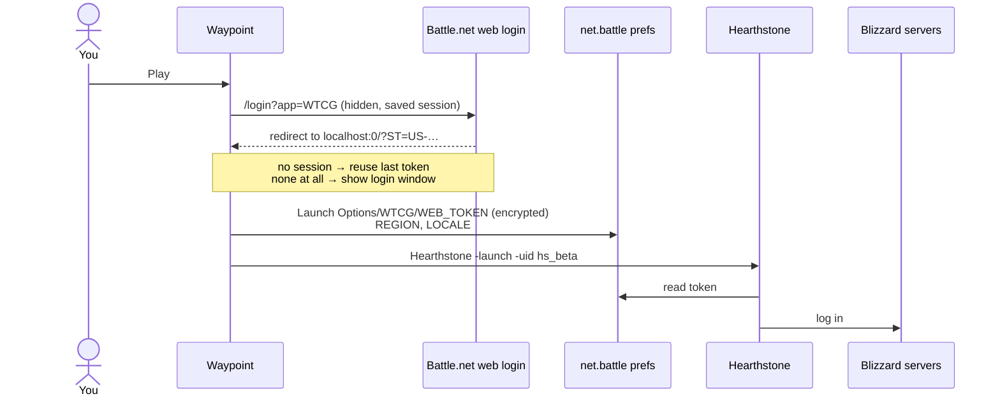

<div align="center">


# Waypoint

**A tiny native launcher for Blizzard games on Apple Silicon Macs.**<br>
No Battle.net app. No Rosetta. Just press Play.

[](https://github.com/wowlocal/waypoint-launcher/releases/latest)
[](#build)
[](#why)
[](#build)
[](#disclaimer)


**English** · [Русский](README.ru.md)

</div>

---

## Why

The Battle.net app for Mac is still Intel-only. Every Apple Silicon Mac needs Rosetta just to open it, even though Hearthstone and World of Warcraft themselves run natively.

That is about to become a real problem: **macOS 27 is the last release with full Rosetta**. From macOS 28 on, Apple keeps only a limited subset for older games.

The only thing you really need a launcher for is logging the game in. Waypoint does just that, natively.

|  | Battle.net | Waypoint |
|---|---|---|
| Architecture | Intel (Rosetta) | Apple Silicon |
| Size on disk | ~1.5 GB | **536 KB** |
| Runs in the background | App + Agent + browser helpers | Nothing |

## Features

- **Native.** Written in Swift, built only for arm64.
- **One sign-in.** Uses the official Battle.net web login once. After that every launch is one click.
- **Updates games itself.** It checks Blizzard's servers, downloads only the files that changed, verifies every one of them, and swaps them in. Hearthstone only for now.
- **Finds your games.** Reads Battle.net's install list and falls back to scanning the game folders, so it keeps working after you delete Battle.net.
- **Changes nothing in the game.** No patches and no injected code: the login is handed over exactly the way Battle.net does it.
- **Menu bar** quick launch.

## Supported games

| Game | Launch | Updates |
|---|---|---|
| Hearthstone | ✅ Tested natively, with the Battle.net app and its Agent fully quit | ✅ Through Waypoint |
| World of Warcraft: Retail, Classic, Classic Era | 🧪 Implemented, not yet tested on macOS | Through Battle.net for now |
| Warcraft III: Reforged | ❌ The game itself is Intel-only, so Rosetta is unavoidable | — |

## Download

Get **Waypoint-x.y.z.dmg** from [Releases](https://github.com/wowlocal/waypoint-launcher/releases/latest), open it, and drag Waypoint to Applications. Releases are signed with a Developer ID and notarized by Apple, so the app opens without warnings.

Requires an Apple Silicon Mac with macOS 14 or later.

## Build

Requires macOS 14+ and Xcode with Swift 6.

```sh
git clone https://github.com/wowlocal/waypoint-launcher.git
cd waypoint-launcher
./scripts/bundle.sh          # → build/Waypoint.app
open build/Waypoint.app
```

Move `Waypoint.app` to `/Applications` if you want to keep it.

<details>
<summary><b>Making a release</b></summary>

`scripts/release.sh` runs the tests, then builds the app and signs it with your Developer ID (hardened runtime). It notarizes and staples the app, then packs it into a DMG and signs, notarizes and staples that too. Finally it checks the result with Gatekeeper.

```sh
# once: store notary credentials in the keychain (use an app-specific password)
xcrun notarytool store-credentials NotaryProfile --apple-id <apple id> --team-id <team id>
# …or use an App Store Connect API key instead: NOTARY_KEY=<.p8> NOTARY_KEY_ID=<id> NOTARY_ISSUER=<uuid>

scripts/release.sh 0.1.0             # → dist/Waypoint-0.1.0.dmg + .sha256
scripts/release.sh 0.1.0 --publish   # also tags v0.1.0 and creates the GitHub release
```

</details>

## Usage

1. Open Waypoint and press **Play**.
2. The first time, sign in to Battle.net in the window that appears. Two-factor auth works.
3. That's it. Later launches skip the login.

When a new version is out, **Play** turns into **Update**, with a progress bar while it downloads.

Right-click the button for more:

- **Sign In Again and Play**: use this if a game ever rejects the login.
- **Verify Files**: re-checks every file and repairs broken ones.
- **Play Without Updating**: shown only when an update is waiting.

> [!NOTE]
> Installing a game from scratch, and updating World of Warcraft, still need the Battle.net app for now (see [Roadmap](#roadmap)).

## How it works

On macOS, Battle.net doesn't pass the login to a game on the command line. It writes an encrypted token into the `net.battle` preferences domain and starts the game, and the game reads the token on startup. Waypoint does the same.



<details>
<summary><b>The details</b></summary>

**Preferences** (`~/Library/Preferences/net.battle.plist`)

| Key | Value |
|---|---|
| `Launch Options/<CODE>/WEB_TOKEN` | encrypted token (data) |
| `Launch Options/<CODE>/REGION` | `EU`, `US`, `KR`, `CN` |
| `Launch Options/<CODE>/LOCALE` | `enUS`, `ruRU`, … |

`<CODE>` is `WTCG` for Hearthstone and `WoW` for every WoW flavor.

**Encryption.** AES-128-CBC with a zero IV and PKCS#7 padding. The key is PBKDF2-HMAC-SHA1 (1000 rounds, salt `someSalt`) over a fixed 16-byte entropy XORed with the macOS user name. This mirrors `RegistryDarwin` in the game's Battle.net SDK. It was checked against tokens written by the real Battle.net app (`waypoint-cli check-tokens`).

**Token.** The Battle.net web login at `https://<region>.battle.net/login/en/?externalChallenge=login&app=<CODE>` finishes with a redirect to `http://localhost:0/?ST=<token>`. The token looks like `US-<32 hex>-<account id>`.

**Launch commands**

| Game | Command | Working directory |
|---|---|---|
| Hearthstone | `Hearthstone.app/…/Hearthstone -launch -uid hs_beta` | install folder |
| WoW | `World of Warcraft.app/…/World of Warcraft -launcherlogin -uid wow` | flavor folder (`_retail_`, `_classic_`, …) |

Games are started with `posix_spawn` and disclaim the launcher as their responsible process, like apps started by Battle.net. So privacy prompts, such as the microphone for WoW voice chat, belong to the game.

**Updates** use Blizzard's content delivery protocol (TACT):

1. Ask `https://<region>.version.battle.net/v2/products/hsb/versions` which build is live.
2. Fetch that build's config and *install manifest* from the CDN. The manifest lists every file with its MD5 and tags (platform, region, language, content).
3. Select files with the tags Battle.net recorded for your install. For Hearthstone that's exactly the 5398 files in its folder.
4. Diff against the installed build's manifest. Only files whose hash changed are downloaded. Without the old manifest, local files are hashed instead (this is what **Verify Files** does).
5. Look up each file's encoded key in the *encoding* table and its location in the CDN archive indexes, then download it with an HTTP range request, decode the BLTE container chunk by chunk, and check the MD5.
6. Once every file is downloaded and verified, swap them in, then delete the files the new build no longer has.

Downloads are staged in `.waypoint-staging` inside the game folder, so an interrupted update resumes where it stopped. Updating refuses to run while the game is open.

**Finding games.** The list comes from `/Users/Shared/Battle.net/Agent/product.db` (protobuf), or from the `.product.db` inside each game folder.

</details>

## Command line

```sh
xcrun swift run waypoint-cli list            # installed games and whether they run natively
xcrun swift run waypoint-cli plan hs_beta    # dry run: how a game would be launched
xcrun swift run waypoint-cli check-tokens    # verify the cipher on tokens Battle.net wrote
xcrun swift run waypoint-cli check-updates   # installed vs. live version
xcrun swift run waypoint-cli update hs_beta --dry-run           # what an update would download
xcrun swift run waypoint-cli update hs_beta --verify --dry-run  # hash-check the whole install
xcrun swift run waypoint-cli fetch hs_beta '^Strings/' /tmp/hs  # download files into another folder
xcrun swift test
WAYPOINT_NETWORK_TESTS=1 xcrun swift test --filter liveUpdate  # real update, 36.6.0 → live, in a temp folder
```

## Roadmap

- [x] Hearthstone
- [x] Sign in once, launch with one click
- [x] Hearthstone updates without Battle.net
- [ ] World of Warcraft tested on macOS
- [ ] World of Warcraft updates (its data lives in CASC storage)
- [ ] Install games from scratch
- [x] Prebuilt, notarized releases
- [x] App icon

## Disclaimer

Waypoint is an unofficial fan project. It is not affiliated with or endorsed by Blizzard Entertainment. Blizzard, Battle.net, Hearthstone, World of Warcraft and Warcraft are trademarks of Blizzard Entertainment, Inc.

Blizzard doesn't officially support launching games outside the Battle.net app. The approach has been used for years (see Credits), but there are no guarantees, and Blizzard can change the login hand-off at any time. Use at your own risk.

## Credits

- [hearthstone-linux](https://github.com/0xf4b1/hearthstone-linux): token encryption and the web login flow
- [BnetTokenator](https://github.com/InvoxiPlayGames/BnetTokenator): the `Launch Options` layout
- [TACTLib](https://github.com/overtools/TACTLib): the `product.db` schema
