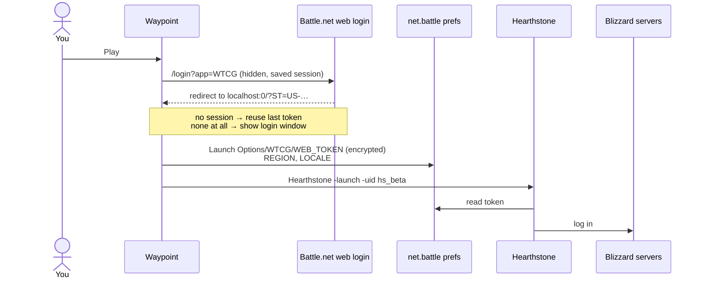

<div align="center">

# Waypoint

**A tiny native launcher for Blizzard games on Apple Silicon Macs.**<br>
No Battle.net app. No Rosetta. Just press Play.

[](#build)
[](#why)
[](#build)
[](#disclaimer)


**English** · [Русский](README.ru.md)

</div>

---

## Why

The Battle.net app for Mac is still Intel-only. Every Apple Silicon Mac needs Rosetta just to open it, even though Hearthstone and World of Warcraft themselves run natively.

That is about to become a real problem: **macOS 27 is the last release with full Rosetta**. From macOS 28 on, Apple keeps only a limited subset for older games.

The only thing you really need a launcher for is logging the game in. Waypoint does just that, natively.

|  | Battle.net | Waypoint |
|---|---|---|
| Architecture | Intel (Rosetta) | Apple Silicon |
| Size on disk | ~1.5 GB | **536 KB** |
| Runs in the background | App + Agent + browser helpers | Nothing |

## Features

- **Native.** Written in Swift, built only for arm64.
- **One sign-in.** Uses the official Battle.net web login once. After that every launch is one click.
- **Finds your games.** Reads Battle.net's install list and falls back to scanning the game folders, so it keeps working after you delete Battle.net.
- **Changes nothing in the game.** No patches and no injected code: the login is handed over exactly the way Battle.net does it.
- **Menu bar** quick launch.

## Supported games

| Game | Status |
|---|---|
| Hearthstone | ✅ **Works.** Tested natively with the Battle.net app and its Agent fully quit |
| World of Warcraft: Retail, Classic, Classic Era | 🧪 Implemented, not yet tested on macOS |
| Warcraft III: Reforged | ❌ The game itself is Intel-only, so Rosetta is unavoidable |

## Build

Requires macOS 14+ and Xcode with Swift 6.

```sh
git clone https://github.com/wowlocal/waypoint-launcher.git
cd waypoint-launcher
./scripts/bundle.sh          # → build/Waypoint.app
open build/Waypoint.app
```

Move `Waypoint.app` to `/Applications` if you want to keep it.

## Usage

1. Open Waypoint and press **Play**.
2. The first time, sign in to Battle.net in the window that appears. Two-factor auth works.
3. That's it. Later launches skip the login.

If a game ever rejects the login, right-click **Play** and choose **Sign In Again and Play**.

> [!NOTE]
> For now the Battle.net app is still what installs and patches your games (see [Roadmap](#roadmap)). Waypoint launches whatever is installed. When a patch is out, update once through Battle.net.

## How it works

On macOS, Battle.net doesn't pass the login to a game on the command line. It writes an encrypted token into the `net.battle` preferences domain and starts the game, and the game reads the token on startup. Waypoint does the same.



<details>
<summary><b>The details</b></summary>

**Preferences** (`~/Library/Preferences/net.battle.plist`)

| Key | Value |
|---|---|
| `Launch Options/<CODE>/WEB_TOKEN` | encrypted token (data) |
| `Launch Options/<CODE>/REGION` | `EU`, `US`, `KR`, `CN` |
| `Launch Options/<CODE>/LOCALE` | `enUS`, `ruRU`, … |

`<CODE>` is `WTCG` for Hearthstone and `WoW` for every WoW flavor.

**Encryption.** AES-128-CBC with a zero IV and PKCS#7 padding. The key is PBKDF2-HMAC-SHA1 (1000 rounds, salt `someSalt`) over a fixed 16-byte entropy XORed with the macOS user name. This mirrors `RegistryDarwin` in the game's Battle.net SDK. It was checked against tokens written by the real Battle.net app (`waypoint-cli check-tokens`).

**Token.** The Battle.net web login at `https://<region>.battle.net/login/en/?externalChallenge=login&app=<CODE>` finishes with a redirect to `http://localhost:0/?ST=<token>`. The token looks like `US-<32 hex>-<account id>`.

**Launch commands**

| Game | Command | Working directory |
|---|---|---|
| Hearthstone | `Hearthstone.app/…/Hearthstone -launch -uid hs_beta` | install folder |
| WoW | `World of Warcraft.app/…/World of Warcraft -launcherlogin -uid wow` | flavor folder (`_retail_`, `_classic_`, …) |

Games are started with `posix_spawn` and disclaim the launcher as their responsible process, like apps started by Battle.net. So privacy prompts, such as the microphone for WoW voice chat, belong to the game.

**Finding games.** The list comes from `/Users/Shared/Battle.net/Agent/product.db` (protobuf), or from the `.product.db` inside each game folder.

</details>

## Command line

```sh
xcrun swift run waypoint-cli list            # installed games and whether they run natively
xcrun swift run waypoint-cli plan hs_beta    # dry run: how a game would be launched
xcrun swift run waypoint-cli check-tokens    # verify the cipher on tokens Battle.net wrote
xcrun swift test
```

## Roadmap

- [x] Hearthstone
- [x] Sign in once, launch with one click
- [ ] World of Warcraft tested on macOS
- [ ] Install and patch games without Battle.net (TACT/NGDP)
- [ ] Hearthstone in-game shop without Battle.net (untested)
- [ ] Prebuilt, notarized releases
- [ ] App icon

## Disclaimer

Waypoint is an unofficial fan project. It is not affiliated with or endorsed by Blizzard Entertainment. Blizzard, Battle.net, Hearthstone, World of Warcraft and Warcraft are trademarks of Blizzard Entertainment, Inc.

Blizzard doesn't officially support launching games outside the Battle.net app. The approach has been used for years (see Credits), but there are no guarantees, and Blizzard can change the login hand-off at any time. Use at your own risk.

## Credits

- [hearthstone-linux](https://github.com/0xf4b1/hearthstone-linux): token encryption and the web login flow
- [BnetTokenator](https://github.com/InvoxiPlayGames/BnetTokenator): the `Launch Options` layout
- [TACTLib](https://github.com/overtools/TACTLib): the `product.db` schema
