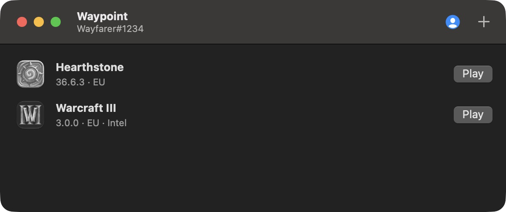
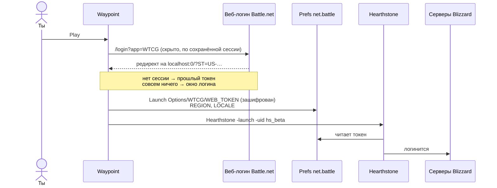

<div align="center">


# Waypoint

**Battle.net без лишнего для маков с Apple Silicon.**<br>
Устанавливает, обновляет и запускает игры Blizzard без приложения Battle.net. Без Rosetta. Просто жмёшь Play.

[](https://github.com/wowlocal/waypoint-launcher/releases/latest)
[](#сборка)
[](#зачем)
[](#сборка)
[](#дисклеймер)



[English](README.md) · **Русский**

</div>

---

## Зачем

Battle.net для Mac до сих пор собран только под Intel. Любому маку на Apple Silicon нужна Rosetta, просто чтобы его открыть, хотя Hearthstone и World of Warcraft сами по себе работают нативно.

Скоро это станет настоящей проблемой: **macOS 27 — последняя версия с полной Rosetta**. Начиная с macOS 28, Apple оставит только урезанную версию для старых игр.

От лаунчера нужно всего три вещи: установить игру, держать её обновлённой и залогинить. Waypoint делает ровно это, нативно и ничего больше.

|  | Battle.net | Waypoint |
|---|---|---|
| Архитектура | Intel (Rosetta) | Apple Silicon |
| Размер на диске | ~1.5 ГБ | **6 МБ** |
| Висит в фоне | приложение + Agent + браузерные хелперы | ничего |

## Возможности

- **Нативный.** Написан на Swift и собран только под arm64.
- **Вход один раз.** Через официальный веб-логин Battle.net. Дальше каждый запуск — в один клик.
- **Устанавливает игры.** Нажми **+** на панели инструментов и выбери игру. Waypoint скачает её прямо с серверов Blizzard и разложит ровно так же, как это делает Battle.net, поэтому игра принимает установку как свою. Прерванная установка продолжится с места остановки. В списке есть все игры Blizzard с версией для Mac; что уже проверено, смотри в разделе [Поддерживаемые игры](#поддерживаемые-игры).
- **Сам обновляет игры.** Спрашивает у серверов Blizzard, есть ли новая версия, качает только изменившиеся файлы, проверяет каждый и подменяет их. Пока только Hearthstone.
- **Обновляется сам** в фоне через [Sparkle](https://sparkle-project.org). Новые версии тихо скачиваются и ставятся, когда ты закрываешь приложение. Окон обновления нет: внизу окна (и в меню в строке меню, если оно включено) появляется небольшое «Restart to Update».
- **Сам находит игры.** Читает список установок Battle.net, а если его нет, сканирует папки игр. Поэтому работает и после удаления Battle.net.
- **Ничего не меняет в игре.** Без патчей и внедрения кода: логин передаётся ровно так же, как это делает Battle.net.
- **Быстрый запуск** из строки меню, по умолчанию выключен. Включается в настройках (⌘,).

## Поддерживаемые игры

| Игра | Установка | Запуск | Обновления |
|---|---|---|---|
| Hearthstone | ✅ Через Waypoint | ✅ Проверено нативно при полностью закрытых Battle.net и Agent | ✅ Через Waypoint |
| Warcraft III: Reforged | ✅ Проверено: те же файлы, что и в установке самого Battle.net | ✅ Проверено. Сама игра только под Intel, поэтому идёт через Rosetta | Пока через Battle.net |
| World of Warcraft: Retail, Classic, Classic Era, Anniversary | 🧪 Реализовано, ещё не проверено | 🧪 Реализовано, ещё не проверено | Пока через Battle.net |
| StarCraft II, StarCraft: Remastered, Diablo III, Heroes of the Storm | 🧪 Реализовано, ещё не проверено | 🧪 Реализовано, ещё не проверено | Пока через Battle.net |

## Скачать

Скачай **Waypoint-x.y.z.dmg** из [Releases](https://github.com/wowlocal/waypoint-launcher/releases/latest), открой и перетащи Waypoint в «Программы». Релизы подписаны Developer ID и нотаризованы Apple, поэтому приложение открывается без предупреждений.

Нужен Mac на Apple Silicon и macOS 14 или новее.

## Сборка

Нужны macOS 14+ и Xcode со Swift 6.

```sh
git clone https://github.com/wowlocal/waypoint-launcher.git
cd waypoint-launcher
./scripts/bundle.sh          # → build/Waypoint.app
open build/Waypoint.app
```

Если хочешь оставить приложение насовсем, перенеси `Waypoint.app` в `/Applications`.

<details>
<summary><b>Как выпустить релиз</b></summary>

`scripts/release.sh` прогоняет тесты, собирает приложение и подписывает его Developer ID (hardened runtime). Потом нотаризует приложение и делает staple, упаковывает его в DMG, подписывает, нотаризует и делает staple для DMG тоже. Проверяет результат через Gatekeeper, затем пишет `appcast.xml` для Sparkle и проверяет его подпись EdDSA.

С `--publish` скрипт делает то же, что snippets: DMG и `appcast.xml` уходят в S3 (`storage.yandexcloud.net/macos-releases/waypoint/`) — это фид обновлений, который читают установленные копии, а DMG дублируется в GitHub Releases. Ключи S3 берутся из `AWS_ACCESS_KEY_ID`/`AWS_SECRET_ACCESS_KEY` или из `scripts/release.env` (в .gitignore).

```sh
# один раз: сохранить данные для нотаризации в Keychain (нужен app-specific пароль)
xcrun notarytool store-credentials NotaryProfile --apple-id <apple id> --team-id <team id>
# …или ключ App Store Connect API: NOTARY_KEY=<.p8> NOTARY_KEY_ID=<id> NOTARY_ISSUER=<uuid>

scripts/release.sh 0.1.0             # → dist/Waypoint-0.1.0.dmg + .sha256
scripts/release.sh 0.1.0 --publish   # плюс тег v0.1.0 и GitHub Release

scripts/test-self-update.sh          # сквозной тест: старая сборка обновляет себя с локального фида
```

Обновления подписываются ключом EdDSA, который лежит в Keychain под аккаунтом `waypoint`. Его публичная часть — в `scripts/bundle.sh`. Сделай резервную копию ключа: без него установленные копии не получится обновить.

```sh
.build/artifacts/sparkle/Sparkle/bin/generate_keys --account waypoint -x waypoint-sparkle.key   # экспорт
.build/artifacts/sparkle/Sparkle/bin/generate_keys --account waypoint -f waypoint-sparkle.key   # импорт на другом Mac
```

</details>

## Как пользоваться

1. Открой Waypoint и нажми **Play**.
2. В первый раз войди в Battle.net в появившемся окне. Двухфакторка работает.
3. Всё. При следующих запусках логин не нужен.

Чтобы установить игру, нажми **+** на панели инструментов и выбери её. Укажи, куда ставить (по умолчанию `/Applications`), язык и регион; в окне видно настоящий размер загрузки. Прогресс показывается в строке игры.

Когда выходит новая версия, **Play** превращается в **Update**, а пока идёт загрузка, виден прогресс.

Правая кнопка мыши на кнопке открывает дополнительные действия:

- **Sign In Again and Play**: если игра когда-нибудь не примет логин.
- **Verify Files**: заново проверяет все файлы и чинит битые.
- **Play Without Updating**: появляется, только когда ждёт обновление.

> [!NOTE]
> Обновлять игры, кроме Hearthstone, пока по-прежнему нужно через Battle.net (см. [Планы](#планы)).

## Как это работает

На macOS Battle.net не передаёт игре логин в командной строке. Он записывает зашифрованный токен в preferences-домен `net.battle` и запускает игру, а игра читает токен на старте. Waypoint делает то же самое.



<details>
<summary><b>Подробности</b></summary>

**Preferences** (`~/Library/Preferences/net.battle.plist`)

| Ключ | Значение |
|---|---|
| `Launch Options/<КОД>/WEB_TOKEN` | зашифрованный токен (data) |
| `Launch Options/<КОД>/REGION` | `EU`, `US`, `KR`, `CN` |
| `Launch Options/<КОД>/LOCALE` | `enUS`, `ruRU`, … |

`<КОД>` равен `WTCG` для Hearthstone и `WoW` для всех версий WoW.

**Шифрование.** AES-128-CBC с нулевым IV и паддингом PKCS#7. Ключ — PBKDF2-HMAC-SHA1 (1000 раундов, соль `someSalt`) от фиксированной 16-байтной энтропии, XOR с именем пользователя macOS. Это повторяет `RegistryDarwin` из Battle.net SDK внутри игры. Проверено на токенах, которые записал настоящий Battle.net (`waypoint-cli check-tokens`).

**Токен.** Веб-логин `https://<region>.battle.net/login/en/?externalChallenge=login&app=<КОД>` в конце редиректит на `http://localhost:0/?ST=<токен>`. Токен выглядит как `US-<32 hex>-<id аккаунта>`.

**Команды запуска**

| Игра | Команда | Рабочая папка |
|---|---|---|
| Hearthstone | `Hearthstone.app/…/Hearthstone -launch -uid hs_beta` | папка установки |
| WoW | `World of Warcraft.app/…/World of Warcraft -launcherlogin -uid wow` | папка версии (`_retail_`, `_classic_`, …) |
| Остальные игры | `<Game>.app/…/<Game> -launch -uid <uid>` | папка установки (Warcraft III: `_retail_`) |

Игры запускаются через `posix_spawn` и сами отвечают за себя перед системой, как и при запуске из Battle.net. Поэтому системные запросы разрешений (например, микрофон для голосового чата WoW) приходят от игры, а не от лаунчера.

**Обновления** работают по протоколу доставки контента Blizzard (TACT):

1. Спрашиваем у `https://<region>.version.battle.net/v2/products/hsb/versions`, какая сборка сейчас актуальна.
2. Берём с CDN конфиг этой сборки и *install-манифест*. В нём перечислены все файлы с их MD5 и тегами (платформа, регион, язык, контент).
3. Выбираем файлы по тегам, которые Battle.net записал для твоей установки. Для Hearthstone это ровно 5398 файлов из его папки.
4. Сравниваем с манифестом установленной сборки и качаем только файлы, у которых изменился хэш. Если старого манифеста нет, хэшируем локальные файлы (это и делает **Verify Files**).
5. Для каждого файла находим закодированный ключ в таблице *encoding* и место в архивах CDN по их индексам. Скачиваем HTTP range-запросом, распаковываем контейнер BLTE по чанкам и проверяем MD5.
6. Когда все файлы скачаны и проверены, подменяем их, а потом удаляем то, чего в новой сборке больше нет.

Загрузки складываются в `.waypoint-staging` внутри папки игры, поэтому прерванное обновление продолжится с места остановки. Пока игра открыта, обновление не запустится.

**Установка.** Hearthstone хранит файлы как есть, поэтому его установка — это обновление в пустую папку. Все остальные игры держат данные в локальном хранилище CASC (`Data/data`), которое игра читает сама. Waypoint скачивает файлы, которые download-манифест сборки перечисляет для твоей платформы и языка, и пишет архивы `data.###`, 16 индексов `.idx` и `shmem` байт в байт так же, как Battle.net Agent. Само приложение и остальные файлы из install-манифеста кладутся в папку игры как есть, рядом с `.build.info`, `Data/config` и `Data/indices`. Установка Warcraft III через Waypoint содержит ровно те же 73 972 файла, что и установка этой сборки через Battle.net, и игра из неё запускается.

**Поиск игр.** Список берётся из `/Users/Shared/Battle.net/Agent/product.db` (protobuf) или из `.product.db` в папке каждой игры, плюс игры, которые установил сам Waypoint.

</details>

## Командная строка

```sh
xcrun swift run waypoint-cli list            # установленные игры и работают ли они нативно
xcrun swift run waypoint-cli plan hs_beta    # dry run: как будет запущена игра
xcrun swift run waypoint-cli check-tokens    # проверка шифра на токенах от Battle.net
xcrun swift run waypoint-cli check-updates   # установленная версия против актуальной
xcrun swift run waypoint-cli update hs_beta --dry-run           # что скачает обновление
xcrun swift run waypoint-cli update hs_beta --verify --dry-run  # проверить хэши всей установки
xcrun swift run waypoint-cli fetch hs_beta '^Strings/' /tmp/hs  # скачать файлы в другую папку
xcrun swift run waypoint-cli install w3 /Applications/Warcraft\ III --dry-run  # что скачает установка игры
xcrun swift run waypoint-cli launch w3        # запустить установленную игру
xcrun swift test
WAYPOINT_NETWORK_TESTS=1 xcrun swift test --filter liveUpdate  # настоящее обновление 36.6.0 → актуальная, во временной папке
```

## Планы

- [x] Hearthstone
- [x] Вход один раз, запуск в один клик
- [x] Обновление Hearthstone без Battle.net
- [x] Установка игр с нуля, для всех игр Blizzard с версией для Mac
- [x] Warcraft III установлен и запущен без Battle.net
- [ ] Проверить World of Warcraft на macOS
- [ ] Обновление игр с хранилищем CASC (World of Warcraft, StarCraft, Diablo III, Warcraft III, Heroes of the Storm)
- [x] Готовые подписанные релизы с нотаризацией
- [x] Самообновление (Sparkle)
- [x] Иконка приложения
- [x] Нативный интерфейс на AppKit (без SwiftUI)

## Дисклеймер

Waypoint — неофициальный фанатский проект. Он не связан с Blizzard Entertainment и не одобрен ею. Blizzard, Battle.net, Hearthstone, World of Warcraft, Warcraft, StarCraft, Diablo и Heroes of the Storm — торговые марки Blizzard Entertainment, Inc.

Blizzard официально не поддерживает запуск игр в обход Battle.net. Этот подход используют годами (см. Благодарности), но гарантий нет, и Blizzard может в любой момент изменить способ передачи логина. Используй на свой риск.

## Благодарности

- [hearthstone-linux](https://github.com/0xf4b1/hearthstone-linux): шифрование токена и веб-логин
- [BnetTokenator](https://github.com/InvoxiPlayGames/BnetTokenator): структура `Launch Options`
- [TACTLib](https://github.com/overtools/TACTLib): схема `product.db`
