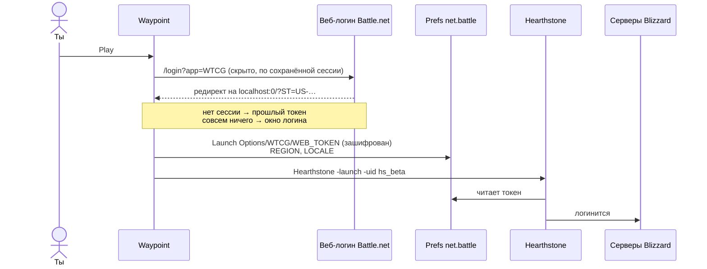

<div align="center">


# Waypoint

**Крошечный нативный лаунчер для игр Blizzard на маках с Apple Silicon.**<br>
Без Battle.net. Без Rosetta. Просто жмёшь Play.

[](#сборка)
[](#зачем)
[](#сборка)
[](#дисклеймер)


[English](README.md) · **Русский**

</div>

---

## Зачем

Battle.net для Mac до сих пор собран только под Intel. Любому маку на Apple Silicon нужна Rosetta, просто чтобы его открыть, хотя Hearthstone и World of Warcraft сами по себе работают нативно.

Скоро это станет настоящей проблемой: **macOS 27 — последняя версия с полной Rosetta**. Начиная с macOS 28, Apple оставит только урезанную версию для старых игр.

Сам лаунчер на деле нужен только для того, чтобы залогинить игру. Waypoint делает ровно это, и нативно.

|  | Battle.net | Waypoint |
|---|---|---|
| Архитектура | Intel (Rosetta) | Apple Silicon |
| Размер на диске | ~1.5 ГБ | **536 КБ** |
| Висит в фоне | приложение + Agent + браузерные хелперы | ничего |

## Возможности

- **Нативный.** Написан на Swift и собран только под arm64.
- **Вход один раз.** Через официальный веб-логин Battle.net. Дальше каждый запуск — в один клик.
- **Сам обновляет игры.** Спрашивает у серверов Blizzard, есть ли новая версия, качает только изменившиеся файлы, проверяет каждый и подменяет их. Пока только Hearthstone.
- **Сам находит игры.** Читает список установок Battle.net, а если его нет, сканирует папки игр. Поэтому работает и после удаления Battle.net.
- **Ничего не меняет в игре.** Без патчей и внедрения кода: логин передаётся ровно так же, как это делает Battle.net.
- **Быстрый запуск** из строки меню.

## Поддерживаемые игры

| Игра | Запуск | Обновления |
|---|---|---|
| Hearthstone | ✅ Проверено нативно при полностью закрытых Battle.net и Agent | ✅ Через Waypoint |
| World of Warcraft: Retail, Classic, Classic Era | 🧪 Реализовано, на macOS ещё не проверено | Пока через Battle.net |
| Warcraft III: Reforged | ❌ Сама игра только под Intel, без Rosetta не обойтись | — |

## Сборка

Нужны macOS 14+ и Xcode со Swift 6.

```sh
git clone https://github.com/wowlocal/waypoint-launcher.git
cd waypoint-launcher
./scripts/bundle.sh          # → build/Waypoint.app
open build/Waypoint.app
```

Если хочешь оставить приложение насовсем, перенеси `Waypoint.app` в `/Applications`.

## Как пользоваться

1. Открой Waypoint и нажми **Play**.
2. В первый раз войди в Battle.net в появившемся окне. Двухфакторка работает.
3. Всё. При следующих запусках логин не нужен.

Когда выходит новая версия, **Play** превращается в **Update**, а пока идёт загрузка, виден прогресс.

Правая кнопка мыши на кнопке открывает дополнительные действия:

- **Sign In Again and Play**: если игра когда-нибудь не примет логин.
- **Verify Files**: заново проверяет все файлы и чинит битые.
- **Play Without Updating**: появляется, только когда ждёт обновление.

> [!NOTE]
> Установка игры с нуля и обновление World of Warcraft пока по-прежнему требуют Battle.net (см. [Планы](#планы)).

## Как это работает

На macOS Battle.net не передаёт игре логин в командной строке. Он записывает зашифрованный токен в preferences-домен `net.battle` и запускает игру, а игра читает токен на старте. Waypoint делает то же самое.



<details>
<summary><b>Подробности</b></summary>

**Preferences** (`~/Library/Preferences/net.battle.plist`)

| Ключ | Значение |
|---|---|
| `Launch Options/<КОД>/WEB_TOKEN` | зашифрованный токен (data) |
| `Launch Options/<КОД>/REGION` | `EU`, `US`, `KR`, `CN` |
| `Launch Options/<КОД>/LOCALE` | `enUS`, `ruRU`, … |

`<КОД>` равен `WTCG` для Hearthstone и `WoW` для всех версий WoW.

**Шифрование.** AES-128-CBC с нулевым IV и паддингом PKCS#7. Ключ — PBKDF2-HMAC-SHA1 (1000 раундов, соль `someSalt`) от фиксированной 16-байтной энтропии, XOR с именем пользователя macOS. Это повторяет `RegistryDarwin` из Battle.net SDK внутри игры. Проверено на токенах, которые записал настоящий Battle.net (`waypoint-cli check-tokens`).

**Токен.** Веб-логин `https://<region>.battle.net/login/en/?externalChallenge=login&app=<КОД>` в конце редиректит на `http://localhost:0/?ST=<токен>`. Токен выглядит как `US-<32 hex>-<id аккаунта>`.

**Команды запуска**

| Игра | Команда | Рабочая папка |
|---|---|---|
| Hearthstone | `Hearthstone.app/…/Hearthstone -launch -uid hs_beta` | папка установки |
| WoW | `World of Warcraft.app/…/World of Warcraft -launcherlogin -uid wow` | папка версии (`_retail_`, `_classic_`, …) |

Игры запускаются через `posix_spawn` и сами отвечают за себя перед системой, как и при запуске из Battle.net. Поэтому системные запросы разрешений (например, микрофон для голосового чата WoW) приходят от игры, а не от лаунчера.

**Обновления** работают по протоколу доставки контента Blizzard (TACT):

1. Спрашиваем у `https://<region>.version.battle.net/v2/products/hsb/versions`, какая сборка сейчас актуальна.
2. Берём с CDN конфиг этой сборки и *install-манифест*. В нём перечислены все файлы с их MD5 и тегами (платформа, регион, язык, контент).
3. Выбираем файлы по тегам, которые Battle.net записал для твоей установки. Для Hearthstone это ровно 5398 файлов из его папки.
4. Сравниваем с манифестом установленной сборки и качаем только файлы, у которых изменился хэш. Если старого манифеста нет, хэшируем локальные файлы (это и делает **Verify Files**).
5. Для каждого файла находим закодированный ключ в таблице *encoding* и место в архивах CDN по их индексам. Скачиваем HTTP range-запросом, распаковываем контейнер BLTE по чанкам и проверяем MD5.
6. Когда все файлы скачаны и проверены, подменяем их, а потом удаляем то, чего в новой сборке больше нет.

Загрузки складываются в `.waypoint-staging` внутри папки игры, поэтому прерванное обновление продолжится с места остановки. Пока игра открыта, обновление не запустится.

**Поиск игр.** Список берётся из `/Users/Shared/Battle.net/Agent/product.db` (protobuf) или из `.product.db` в папке каждой игры.

</details>

## Командная строка

```sh
xcrun swift run waypoint-cli list            # установленные игры и работают ли они нативно
xcrun swift run waypoint-cli plan hs_beta    # dry run: как будет запущена игра
xcrun swift run waypoint-cli check-tokens    # проверка шифра на токенах от Battle.net
xcrun swift run waypoint-cli check-updates   # установленная версия против актуальной
xcrun swift run waypoint-cli update hs_beta --dry-run           # что скачает обновление
xcrun swift run waypoint-cli update hs_beta --verify --dry-run  # проверить хэши всей установки
xcrun swift run waypoint-cli fetch hs_beta '^Strings/' /tmp/hs  # скачать файлы в другую папку
xcrun swift test
WAYPOINT_NETWORK_TESTS=1 xcrun swift test --filter liveUpdate  # настоящее обновление 36.6.0 → актуальная, во временной папке
```

## Планы

- [x] Hearthstone
- [x] Вход один раз, запуск в один клик
- [x] Обновление Hearthstone без Battle.net
- [ ] Проверить World of Warcraft на macOS
- [ ] Обновление World of Warcraft (его данные лежат в хранилище CASC)
- [ ] Установка игр с нуля
- [ ] Готовые подписанные релизы с нотаризацией
- [x] Иконка приложения

## Дисклеймер

Waypoint — неофициальный фанатский проект. Он не связан с Blizzard Entertainment и не одобрен ею. Blizzard, Battle.net, Hearthstone, World of Warcraft и Warcraft — торговые марки Blizzard Entertainment, Inc.

Blizzard официально не поддерживает запуск игр в обход Battle.net. Этот подход используют годами (см. Благодарности), но гарантий нет, и Blizzard может в любой момент изменить способ передачи логина. Используй на свой риск.

## Благодарности

- [hearthstone-linux](https://github.com/0xf4b1/hearthstone-linux): шифрование токена и веб-логин
- [BnetTokenator](https://github.com/InvoxiPlayGames/BnetTokenator): структура `Launch Options`
- [TACTLib](https://github.com/overtools/TACTLib): схема `product.db`
